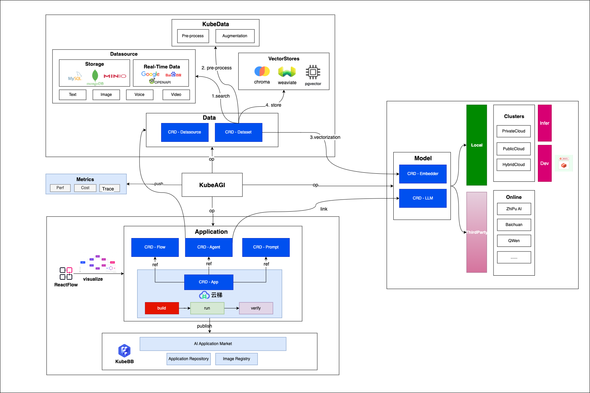

# Arcadia: A diverse, simple, and secure one-stop LLMOps platform

<div align="left">
  <p>
    <a href="https://opensource.org/licenses/apache-2-0">
      
    </a>
    <a href="https://opensource.org/licenses/apache-2-0">
      
    </a>
  </p>
</div>

## What is Arcadia?

**Arcadia** comes from [Greek mythology](https://www.greekmythology.com/Myths/Places/Arcadia/arcadia.html)(a tranquil and idyllic region, representing harmony, serenity, and natural beauty).We aim to help everyone find a more perfect integration between humans and AI.

To archieve this goal, we provides this one-stop LLMOps solution:

- Dataset Management: storage/real-time data,multimodal,pre-processing,vectorization
- Models Management: local/online LLMs(development,training,deployment),inference acceleration
- Application Management: development,optimization,deployment with visual editor

Furthermore,we can easily host **Arcadia** at any kubernetes cluster as production ready by integrating [kubebb](https://github.com/kubebb)(A kubernetes building blocks),

## Architecture

Our design and development in Arcadia design follows operator pattern which extends kubernetes APIs.



## Quick Start

### Pre-requisites

1. [helm](https://helm.sh/docs/intro/install/)

2. [Kubernetes](https://kubernetes.io/)

If you don't have a kubernetes cluster, you can schedule a [kind cluster](https://kind.sigs.k8s.io/). Depends on your choice on CPU or GPU when running LLM worker,you can choose to:

- [Schedule a kind cluster without GPU enabled](./doc/kind.md)
- [Schedule a kind cluster with GPU enabled](./doc/kind_gpu.md)

### Install Arcadia

```shell
  helm repo add arcadia https://kubeagi.github.io/arcadia
  helm repo update
  helm install --namespace arcadia --create-namespace arcadia arcadia/arcadia 
```

## CLI

We provide a Command Line Tool `arctl` to interact with `arcadia`. See [here](./arctl/README.md) for more details.

- ✅ local dataset management

## Pure Go Toolchains

To enhace the AI capability in Golang, we developed some packages.Here are the examples of how to use them.

- [chat_with_document](https://github.com/kubeagi/arcadia/tree/main/examples/chat_with_document): a chat server which allows you to chat with your document
- [embedding](https://github.com/kubeagi/arcadia/tree/main/examples/embedding) shows how to embedes your document to vector store with embedding service
- [rbac](https://github.com/kubeagi/arcadia/blob/main/examples/rbac/main.go) shows how to inquiry the security risks in your RBAC with AI.
- [zhipuai](https://github.com/kubeagi/arcadia/blob/main/examples/zhipuai/main.go) shows how to use this [zhipuai client](https://github.com/kubeagi/arcadia/tree/main/pkg/llms/zhipuai)
- [dashscope](https://github.com/kubeagi/arcadia/blob/main/examples/dashscope/main.go) shows how to use this [dashscope client](https://github.com/kubeagi/arcadia/tree/main/pkg/llms/dashscope) to chat with qwen-7b-chat / qwen-14b-chat / llama2-7b-chat-v2 / llama2-13b-chat-v2 and use embedding with dashscope text-embedding-v1 / text-embedding-async-v1

### LLMs

- ✅ [ZhiPuAI(智谱 AI)](https://github.com/kubeagi/arcadia/tree/main/pkg/llms/zhipuai)
  - [example](https://github.com/kubeagi/arcadia/blob/main/examples/zhipuai/main.go)
- ✅ [DashScope(灵积模型服务)](https://github.com/kubeagi/arcadia/tree/main/pkg/llms/dashscope)
  - see [example](https://github.com/kubeagi/arcadia/blob/main/examples/dashscope/main.go)

### Embeddings

> Fully compatible with [langchain embeddings](https://github.com/tmc/langchaingo/tree/main/embeddings)

- ✅ [ZhiPuAI(智谱 AI) Embedding](https://github.com/kubeagi/arcadia/tree/main/pkg/embeddings/zhipuai)
- ✅ [DashScope(灵积模型服务) text-embedding-v1(通用文本向量 同步接口)](https://help.aliyun.com/zh/dashscope/developer-reference/text-embedding-api-details)

### VectorStores

> Fully compatible with [langchain vectorstores](https://github.com/tmc/langchaingo/tree/main/vectorstores)

- ✅ [ChromaDB](https://docs.trychroma.com/)

## Contribute to Arcadia

If you want to contribute to Arcadia, refer to [contribute guide](CONTRIBUTING.md).

## Support

If you need support, start with the troubleshooting guide, or create GitHub [issues](https://github.com/kubeagi/arcadia/issues/new)
