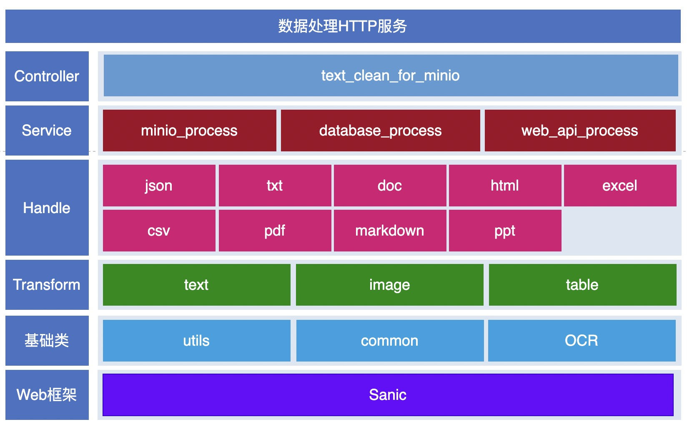

# Data Process

## 当前版本主要功能
Data Process用于做数据处理，通MinIO、数据库、Web API等方式获取数据，数据类型包括一下几种：
- txt
- json
- doc
- html
- excel
- csv
- pdf
- markdown
- ppt

### 当前文本类型处理
数据处理的过程包括：异常数据清洗、过滤、去重、去隐私。

## 设计

## 本地开发
### 软件要求
本地搭建 data-process 环境之前请确保已经安装一下软件：
- Python 3.10.x

### 环境搭建
安装 requirements.txt 中的python依赖包

### 运行
python data_manipulation/server.py文件